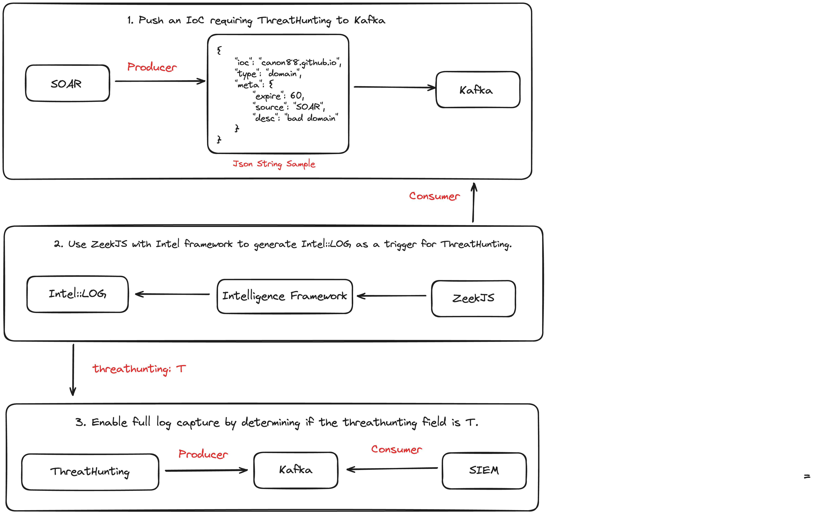

# Zeek Threat Hunting Integration

This project aims to implement threat hunting in network traffic using Zeek scripts and configurations, with intelligence sharing via Kafka.

## Environment

- version: zeek version 6.2.0-dev.500

## File List

- `threathunting.zeek`: The main Zeek script that loads necessary frameworks and configurations, setting global variables for threat hunting.
- `http-threathunting.zeek`: A Zeek script for threat hunting in HTTP traffic, extending HTTP logs to include fields specific to threat hunting.
- `threathunting.js`: A JavaScript script for consuming messages from Kafka and inserting intelligence items into Zeek's intelligence framework.
- `threathunting.dat`: A configuration file to enable the threat hunting feature.

## Configuration Steps

1. Ensure the Zeek environment is installed and the Kafka plugin is configured.
2. Place all script files in the Zeek script directory.
3. Include the `threathunting.zeek` script in the Zeek configuration.
4. Modify the Kafka server address and port in `threathunting.zeek`, along with other related configurations, according to your environment.
5. Start Zeek and confirm that the threat hunting functionality is activated.

## Feature Description

- **Threat Intelligence Sharing**: Uses Kafka as middleware for real-time sharing of threat intelligence.
- **HTTP Traffic Monitoring**: Specific logging for HTTP traffic to facilitate subsequent threat analysis.
- **Dynamic Intelligence Handling**: Consumes intelligence data from Kafka using a JavaScript script and dynamically inserts it into Zeek's intelligence framework for real-time threat identification.

## Notes

- Ensure the Zeek version is compatible with the project scripts.
- The Kafka server should be pre-configured and ensure smooth network communication.
- Adjust the configuration items in the scripts according to the actual situation.

## Workflow



## Directory Structure

```
$ tree threat-hunting
threat-hunting
├── config.dat
├── config.zeek
├── __load__.zeek
├── main.zeek
├── plugins
│   ├── conn
│   │   ├── investigation.zeek
│   ├── dns
│   │   ├── investigation.zeek
│   ├── http
│   │   ├── investigation.zeek
│   │   └── normalized.zeek
│   └── __load__.zeek
└── threathunting.js
```

## Script Structure


## How to Use

**Let’s get hands-on and write our own plugin!**

Usually, you only need to create an `investigation.zeek` script and edit the contents of `Intel::seen_policy` and `HTTP::log_policy`. If you have a normalization requirement, you can also create a `normalized.zeek` to implement normalization. Here is an example of creating `./plugins/http/investigation.zeek`:

- First, add a `threathunting` field of type `bool` to the logs you need. Here it is `HTTP::Info`.

```
 redef record HTTP::Info += {
     threathunting: bool &log &optional;
 };
```

- Then, use Intel::seen_policy to set threathunting field to True when matching intelligence. Here, remember to add ThreatHunting::enable_module HTTP to config.dat. It will be used to control the hot start and stop of the plugin.

```
 # Hook for filtering Intel log entries based on predefined criteria.
 hook Intel::seen_policy(s: Intel::Seen, found: bool)
 {
     # Break if there is no match.
     if ( ! found )
         break;

     # Check if the current log entry matches the set investigation criteria.
     if ( ("HTTP" in enable_module) && (s$conn?$http) )
         s$conn$http$threathunting = T;
 }
```

- Finally, use HTTP::log_policy to capture logs when threathunting field is True. Done! Isn’t it simple?

```
hook HTTP::log_policy(rec: HTTP::Info, id: Log::ID, filter: Log::Filter)
 {
     if ( filter$name == "http_investigation" ) {
         if (! rec?$threathunting) {
             break;
         }
     }
 }
```

## Demo


